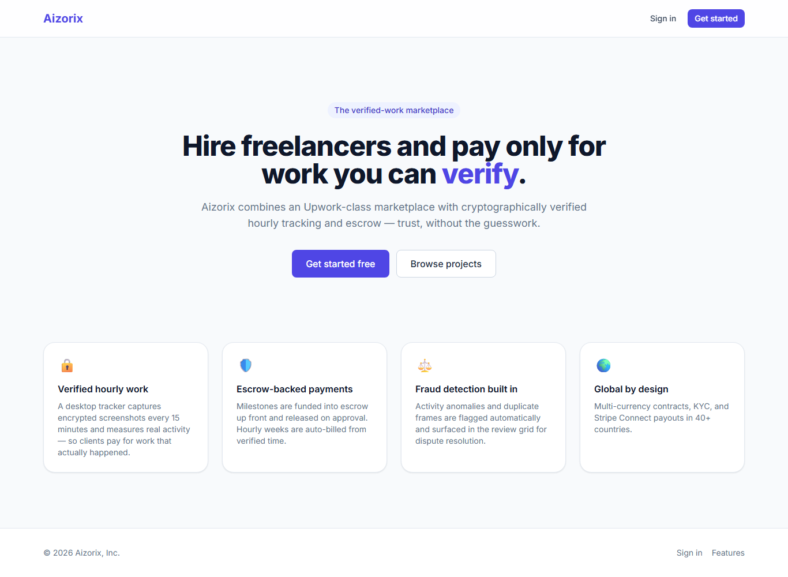
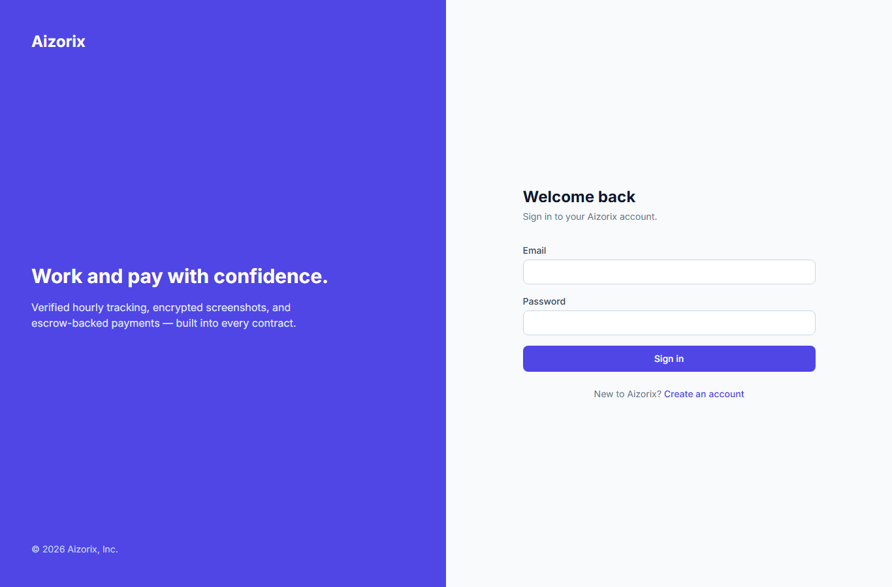
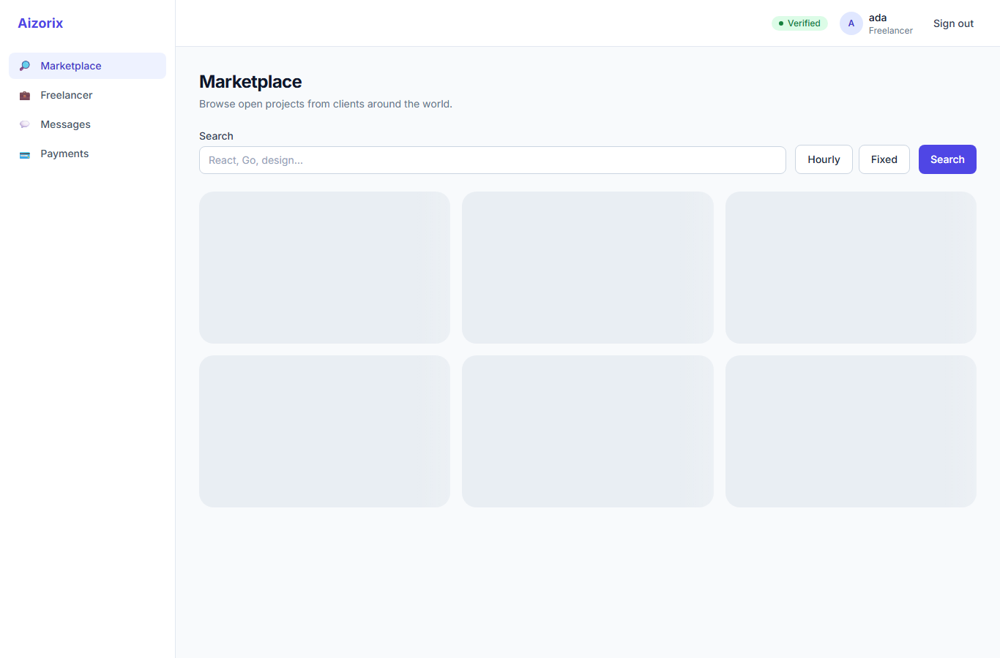

# Aizorix — Live Demo

> **Hire freelancers and pay only for work you can verify.** An Upwork-class marketplace with
> a cryptographically-verified hourly tracker, escrow-backed payments, and an event-driven
> backend — every tier proven running against real infrastructure.

The screenshots below were captured by an **automated Playwright browser** driving the real UI
against the live backend (Next.js → API gateway → services → PostgreSQL). Nothing here is a
mockup — it is the running system.

## Run it yourself (one command)

```powershell
make demo            # infra + 6 services + event backbone + frontend + smoke + browser test
#   → Gateway:  http://localhost:8080
#   → Web app:  http://localhost:3000   (login: ada@aizorix.dev / DemoPassw0rd!)
make demo-down       # tear it all down
```

`make demo` is idempotent and self-provisioning — it brings up Postgres/Redis/MinIO/Redpanda on
isolated ports, applies migrations, seeds demo data, starts the services + relay + consumers,
builds and serves the web app (auto-handling the repo's `&`-in-path quirk and the Node version),
then runs the smoke flows and a Playwright click-through. Full reproduction notes in
[`docs/RUN_LOG.md`](docs/RUN_LOG.md).

---

## Visual walkthrough

### 1. Landing — the verified-work marketplace
SSR-rendered marketing page; the four pillars are the platform's actual capabilities.



### 2. Sign in
The form posts through the Next.js proxy → API gateway → auth service → Postgres. Argon2id
password verification; the gateway issues an ES256 JWT.



### 3. Authenticated dashboard
After login the gateway verifies the JWT (locally, via JWKS), injects the identity, and the
role-filtered dashboard renders — here as **ada (Freelancer)**, "Verified" badge and all.



*(The project cards show loading skeletons because the optional search/project services aren't
in the minimal demo set — the page chrome, auth, and navigation all render correctly.)*

---

## What's proven live (every flow, against real infra)

| Flow | Verified result |
|------|-----------------|
| **Identity** | register → login → `/me` through the gateway; unauth → 401; seed↔auth Argon2 agree |
| **Verified hourly work → escrow payout** | server recomputes activity **90%** from raw samples → bills 0.9h × \$70 = **\$63** → escrow releases exactly \$63; **double-entry ledger nets 0** |
| **Encrypted screenshot pipeline** | on-device AES-256-GCM → presigned upload to MinIO → signature verified vs the **enrolled** device key → authorized decrypt recovers the exact bytes |
| **Event backbone** | outbox → relay → Kafka → consumers; analytics `event_counts` rollup; GMV de-dup holds; notifications fan out |
| **Browser → DB** | Playwright click-through **4/4**: landing → login → authenticated dashboard |

These were exercised end-to-end and caught **9 real runtime bugs** (a missing JWKS endpoint, a
Postgres type-inference error, a Kafka topic mismatch, a dedupe-ordering bug, a `Secure`-cookie-
over-HTTP bug, …) — each now fixed and guarded by a regression test. See
[`docs/RUN_LOG.md`](docs/RUN_LOG.md).

---

## The differentiator

Unlike a generic marketplace, **hourly contracts are cryptographically verified**:

```
 desktop tracker (Tauri/Rust)              backend                         clients/admins
 ───────────────────────────              ───────                         ──────────────
 capture screen every 15 min ─┐
 measure REAL activity %       │  encrypted blob ──► S3 (device↔S3 direct, never via services)
 AES-256-GCM encrypt on-device │  KMS-wrapped DEK, Ed25519-signed metadata
 sign + offline-queue ─────────┼──► screenshot/timetracking svc ──► weekly billing ──► escrow
                               │      (server recomputes activity; fraud signals on the side)
 work offline, sync later  ────┘                                          view screenshots,
                                                                          approve/dispute hours
```

The server **never trusts** the client's reported activity — it recomputes the percentage from
raw input samples, flags macros/jigglers, and verifies each screenshot's signature against the
device's enrolled key before a single cent is billed.

---

## Architecture at a glance

- **Backend:** Go microservices (auth, user, project, proposal, contract, timetracking,
  screenshot, payment, escrow, review, messaging, notification, search, fraud, admin, analytics)
  + an API gateway, an outbox relay, and a WebSocket gateway — gRPC/REST internally, Kafka events.
- **Differentiator client:** Tauri + Rust desktop tracker (encrypted capture, activity engine,
  offline SQLite queue, resumable sync).
- **Frontend:** Next.js 14 (App Router) + React Query + Tailwind.
- **Data:** PostgreSQL (partitioned, double-entry ledger, hash-chained audit), Redis, S3, OpenSearch.
- **Platform:** Terraform (EKS/RDS/MSK/S3/KMS), Kustomize, GitHub Actions, Prometheus/Grafana/Loki.

Full design: [`docs/ARCHITECTURE.md`](docs/ARCHITECTURE.md) · phase-by-phase map:
[`ROADMAP.md`](ROADMAP.md) · security & compliance: [`docs/SECURITY.md`](docs/SECURITY.md),
[`docs/COMPLIANCE.md`](docs/COMPLIANCE.md).
